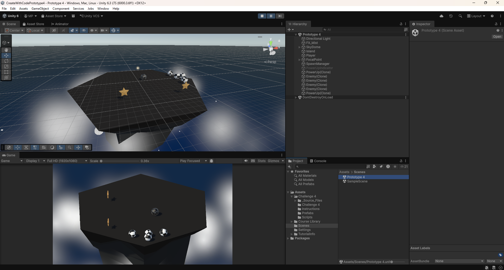
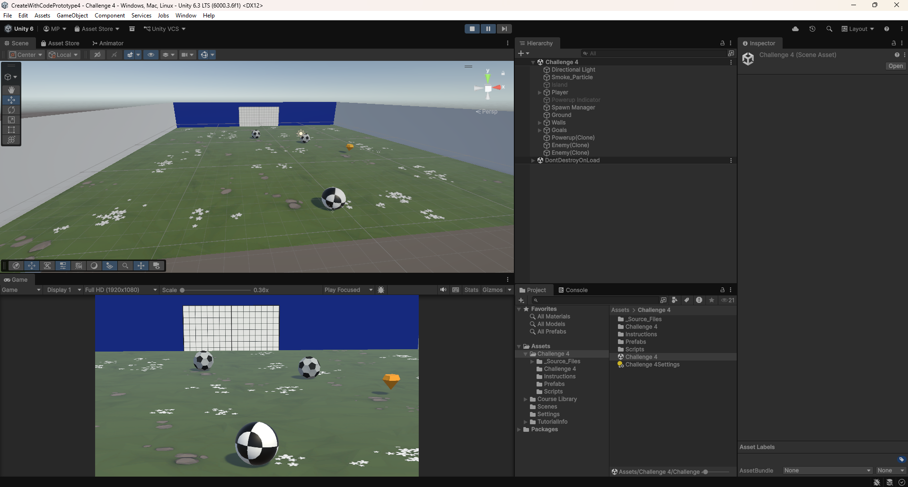

# Create With Code - Prototype 4

This project was created while completing the **Create With Code** course on **Unity Learn**.

In this prototype, the player controls a sphere on a floating island while waves of enemies continuously spawn and attempt to knock the player off the platform. Power-ups temporarily increase the player's knockback force, allowing enemies to be launched off the island before the next wave begins. This prototype introduced more advanced gameplay programming concepts, including enemy AI, timed events, and camera-relative movement.

---

## Gameplay

- Control a sphere on a floating island.
- Defeat waves of enemies by knocking them off the platform.
- Collect power-ups to increase your knockback strength.
- Survive increasingly difficult enemy waves.
- Move freely around the island using camera-relative controls.

---

## What I Learned

This prototype introduced me to several advanced Unity systems and gameplay mechanics, including:

- Coroutines (`IEnumerator`) for timed events
- Wave-based enemy spawning
- Basic enemy AI that constantly follows the player
- Camera-relative player movement
- The Unity Input System
- Power-up mechanics
- Applying forces using Rigidbody physics
- Managing gameplay progression through multiple enemy waves

---

## Challenge 4 - Soccer Scripting Challenge

Alongside the main prototype, I completed another programming challenge where I was given a pre-built game containing several bugs that needed to be identified and fixed.

In this challenge, the player controls a sphere and must prevent footballs from rolling into the goal by knocking them away before they score. The project contained multiple gameplay and scripting issues that affected player movement, object behaviour, and overall gameplay.

Debugging this challenge further improved my ability to analyse existing Unity projects, locate gameplay bugs, and implement effective fixes.

---

## Screenshots

### Gameplay

### Challenge

---

## Technologies Used

- Unity 6
- C#
- Unity Input System
- Rigidbody Physics
- Coroutines (`IEnumerator`)
- Enemy AI
- Camera-Relative Movement
- Wave Spawning
- Power-up System

---

## About

This project is the fourth of five prototypes completed as part of Unity Learn's **Create With Code** course. Each prototype introduces progressively more advanced Unity features and C# programming concepts while building small, playable games.